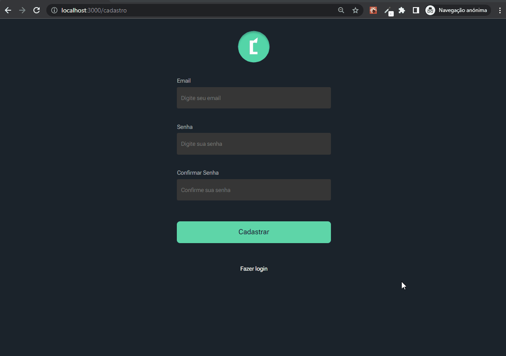
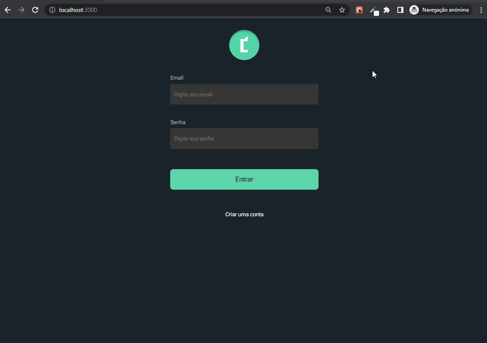
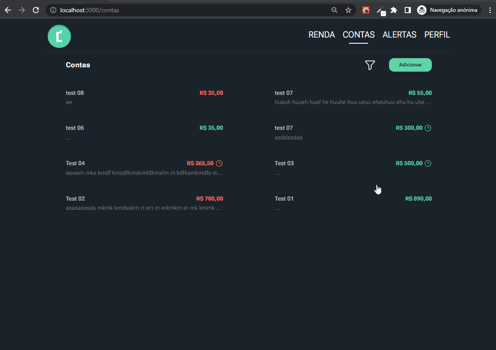
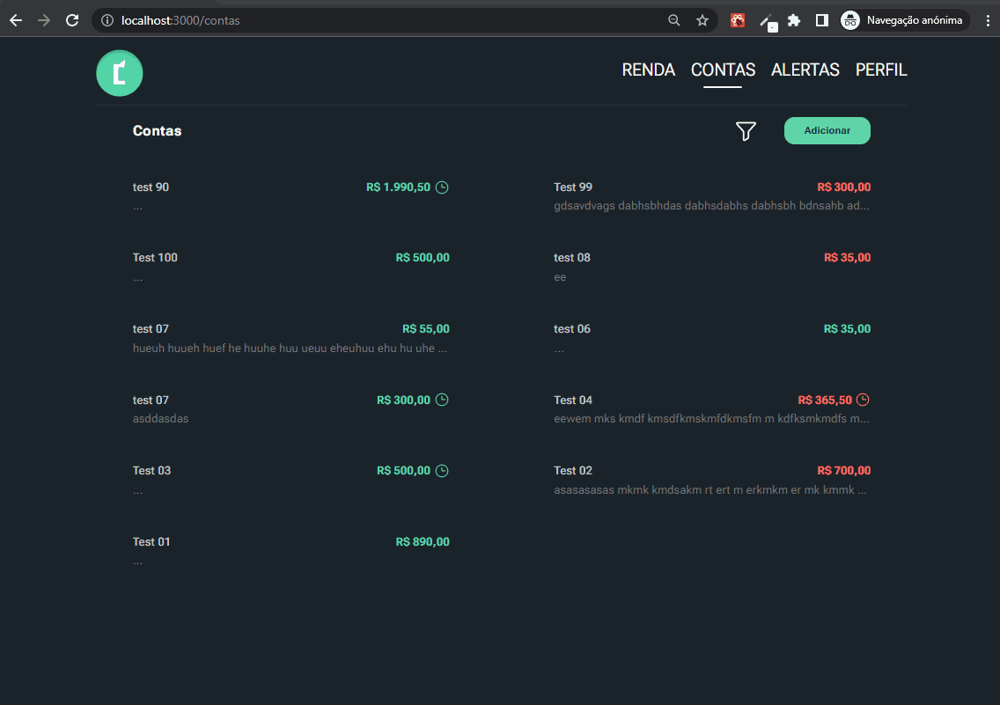
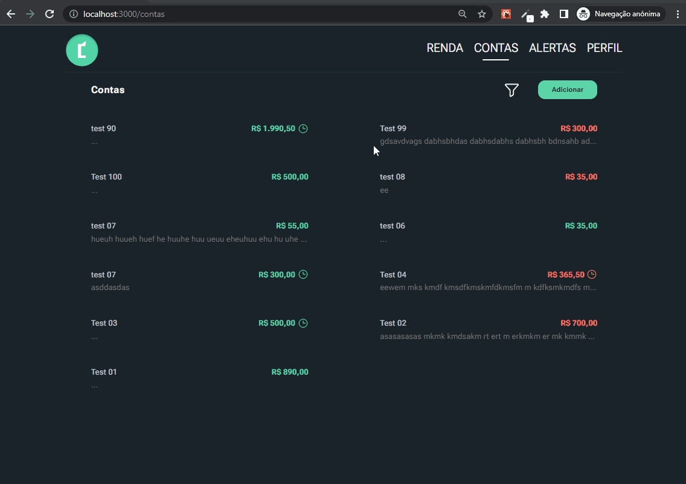
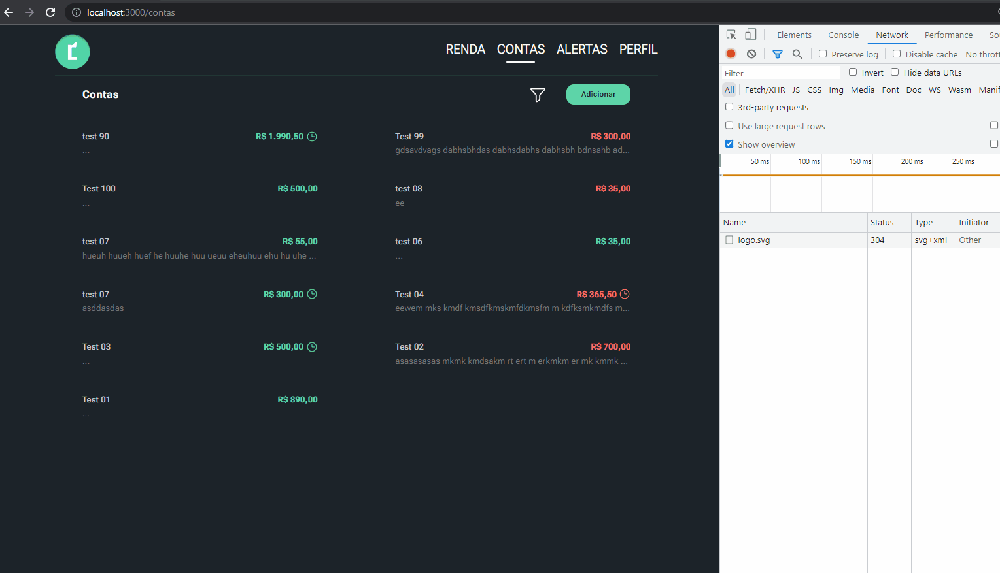
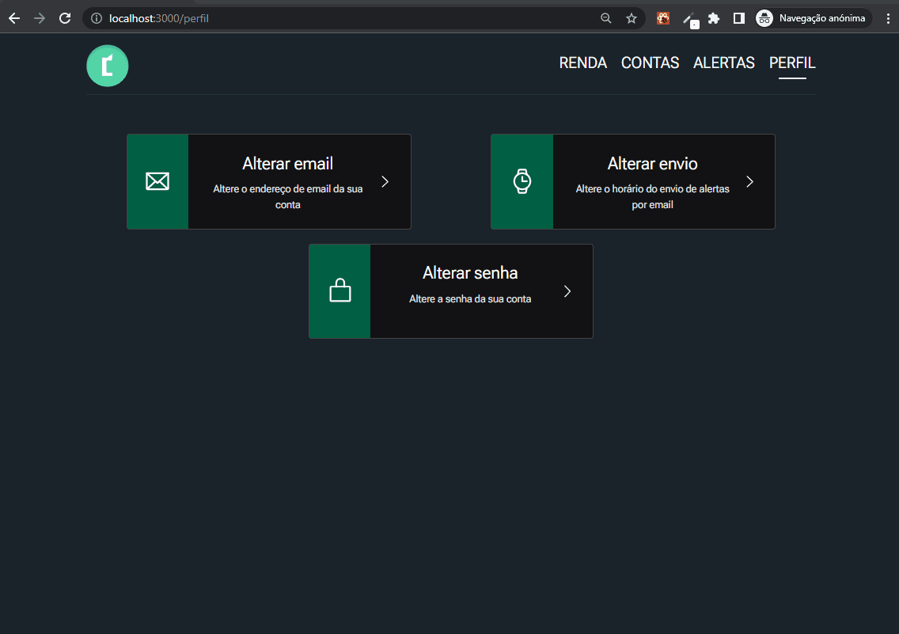
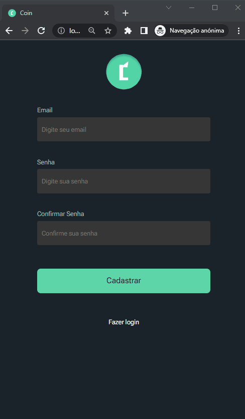

<h1>Coin-Frontend</h1>

    Este projeto é para controle financeiro, aqui contém apenas o front-end. Acesse o código do backend em: <a href="https://github.com/dhomini-rabelo/Coin-Backend">https://github.com/dhomini-rabelo/Coin-Backend</a>.

<h2 id="tools">🛠️ Principais ferramentas</h2>

<ul>
<li>Vite ts</li>
<li>Tailwind</li>
<li>Styled-components</li>
<li>Phosphor-react</li>
<li>date-fns</li>
<li>react-router-dom</li>
<li>react-hook-form</li>
<li>react-query</li>
<li>hookform/error-message</li>
<li>zod</li>
<li>date-fns</li>
<li>axios</li>
<li>headlessui</li>
<li>zod</li>
</ul>

 
<h2 id="project">🎥 Projeto</h2>

<ul>

<li>
<h3>Cadastro de usuários</h3>

A validação de formulário é feita com zod neste projeto

 
<kbd></kbd>
</li>

 
<li>
<h3>Login</h3>

A autenticação é feita usando tokens JWT, esses tokens são salvos no localStorage. 
A classe que faz o controle do armazenamento desses tokens esta em "project\src\code\controllers\Auth\index.ts".

 
<kbd></kbd>
</li>

 
<li>
<h3>Alteração de dados do usuário</h3>

Criei um hook personalizado para mostrar mensagens ao usuário, este hook esta em "project\src\code\hooks\useFeedback\index.tsx".

 
<kbd></kbd>
</li>

 
<li>
<h3>Criando e visualizando contas</h3>
 
<kbd></kbd>
</li>

 
<li>
<h3>Filtrando contas</h3>
 
<kbd></kbd>
</li>

 
<li>
<h3>Visualização de dados financeiros</h3>

Mostra as últimas 10 contas.

 
<kbd></kbd>
</li>

 
<li>
<h3>Listagem de dados com react-query</h3>

A listagem de compras é feita usando react-query, com cache de 1 minuto (usando recarregamento após evento de foco),
como pode ser observado o cache permanece mesmo com as rerenderizações. 
Quando uma nova conta é adicionada o cache é removido.

 
<kbd></kbd>
</li>

 
<li>
<h3>Autenticação - tokens no local Storage</h3>

Os tokens são salvos no localStorage, isso permite que após o refresh da página o usuário continue autenticado. Se esse refresh acontecer depois do token
ter sido expirado o usuário é redirecionado para a página de login.

 
<kbd></kbd>
</li>

 
<li>
<h3>Telas no mobile</h3>
 
<kbd></kbd>
</li>

</ul>