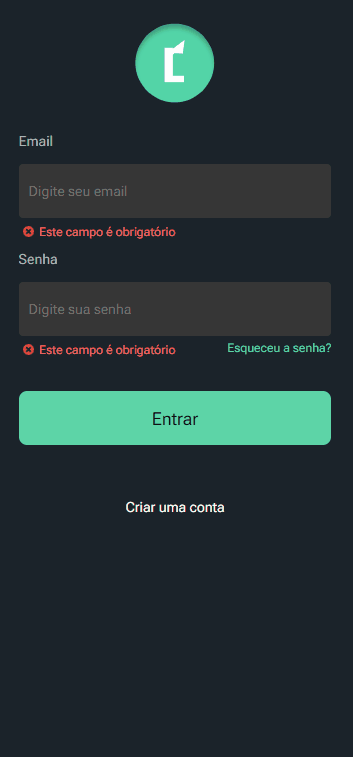

<h1>Coin-Frontend ( 🛠️ Em construção )</h1>

    Este projeto é para controle financeiro, aqui contém apenas o front-end. Acesse o código do backend em: <a href="https://github.com/dhomini-rabelo/Coin-Backend">https://github.com/dhomini-rabelo/Coin-Backend</a>.

 

 
 
